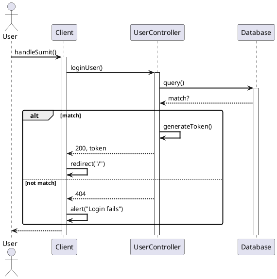

# Create Story

```plantuml
@startuml
skinparam sequenceArrowThickness 2
skinparam roundcorner 5
skinparam ParticipantPadding 50

actor User
participant "Client" as C
participant "UserController" as U
participant "Database" as D


User -> C: handleSumit()
activate C

C -> U: loginUser()
activate U

U -> D: query()
activate D
D --> U: match?

alt match
    U -> U: generateToken()
    U --> C: 200, token
    C -> C: redirect("/")
else not match
    U --> C: 404
    C -> C: alert("Login fails")
end

C --> User

@enduml
```
