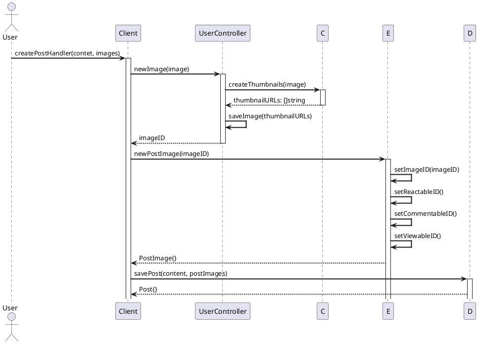

# Search for contact

```plantuml
@startuml
skinparam sequenceArrowThickness 2
skinparam roundcorner 5
skinparam ParticipantPadding 50

actor User
participant "Client" as A
participant "UserController" as B

User -> A: createPostHandler(contet, images)
activate A


A -> B: newImage(image)
activate B

B->C: createThumbnails(image)
activate C

C-->B: thumbnailURLs: []string
deactivate C

B->B: saveImage(thumbnailURLs)

B-->A: imageID
deactivate B

A->E: newPostImage(imageID)
activate E

E->E: setImageID(imageID)

E->E: setReactableID()

E->E: setCommentableID()

E->E: setViewableID()

E-->A: PostImage{}


A->D: savePost(content, postImages)
activate D

D-->A: Post{}

@enduml
```
