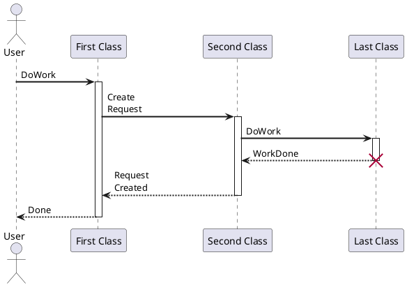

# Create Story

```plantuml
@startuml
skinparam sequenceArrowThickness 2
skinparam roundcorner 5
skinparam maxmessagesize 60
skinparam ParticipantPadding 50

actor User
participant "First Class" as A
participant "Second Class" as B
participant "Last Class" as C

User -> A: DoWork
activate A

A -> B: Create Request
activate B

B -> C: DoWork
activate C
C --> B: WorkDone
destroy C

B --> A: Request Created
deactivate B

A --> User: Done
deactivate A

@enduml
```